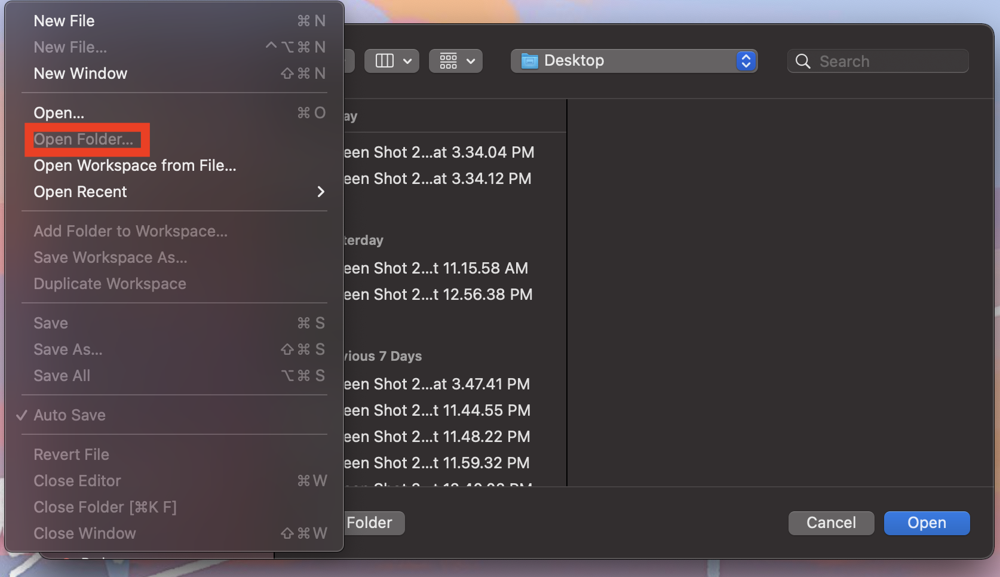
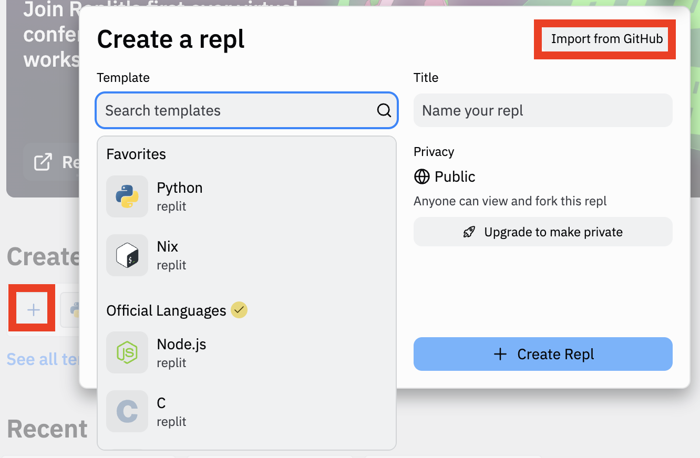
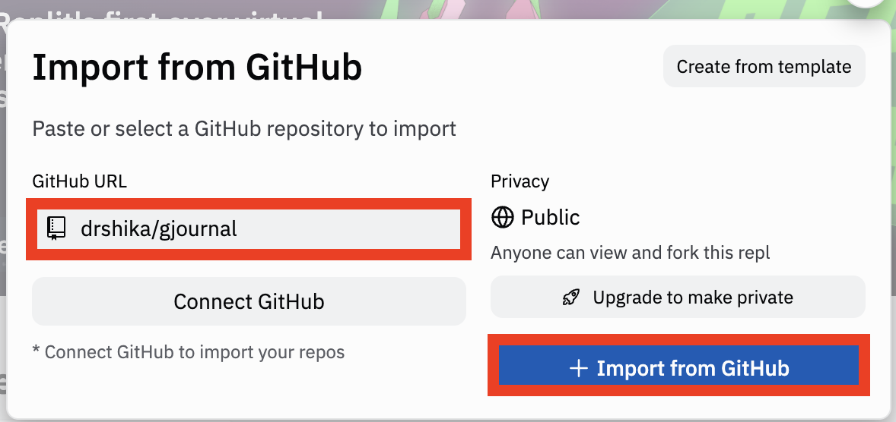

Taught by Drshika Asher, Justin Hu, and Joanna Huang

------------------------------------------

# Getting Ready

### Local Machine Instructions

1. Download a **text editor** (VSCode: https://code.visualstudio.com/download) and make sure you have a version of **python** greater than 3.0 and https://pip.pypa.io/en/stable/installation/ installed. To check your python version, run the following command:
```bash
   $  python --version
```
- Tutorial for Windows: https://feaforall.com/how-to-install-python-3-on-windows-and-set-the-path/
- Tutorial for Mac: https://www.educative.io/edpresso/how-to-add-python-to-the-path-variable-in-mac
- Install Pip: https://pip.pypa.io/en/stable/installation/
2. Clone starter code
```bash
    $ git clone https://github.com/drshika/gjournal.git
```
3. Open folder in VSCode
```bash
    $ code .
```
or open VSCode, File >> Open Folder >> choose the gjournal directory


4. Install requirements
Run the following in your terminal
```bash
    $ pip install -r requirements.txt
```

### Repl.it Instructions
Just in case your local machine does not work for some reason.
1. Log onto your [https://replit.com/~](https://replit.com/~)
2. Create Repl 


3. Install requirements
Run the following in your console
```bash
    $ pip install -r requirements.txt
```


### Extras:

2. Learn a bit of git on the commmand line. You can use any intro tutorial, but [this web browser one](https://learngitbranching.js.org/) looks good.

3. Learn some basics of how a command line works. [Here is a quick crash course](https://www.vikingcodeschool.com/web-development-basics/a-command-line-crash-course) with links to resources to learn even more. The command line is intimidating, but once you get used to it, you'll wonder how you lived without it. It's part of almost every programmer's toolbox.

# Workshop

Justin, Drshika, and Joanna were too busy with their algorithms class and procrastinated creating this workshop! Oh no! Now, we need **YOUR** help to fix some bugs, write some functions and create a wholesome gratitude journal for your command line. 

You will learn how to work with different Python Libraries, read test outputs and documentation, read existing code and integrate your work into the code base.

Prior Knowledge: Intermediate/Advanced Programming

Note: I've done this on MacOs Monterey 12.1 but you should be able to do this on any computer. Your progress shouldn't be drastically different, but you may need to adjust depending on how your OS does things. I used `python 3.9.9`.

# Background

